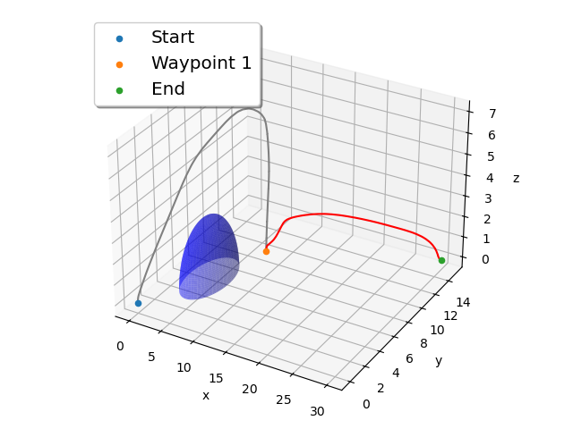
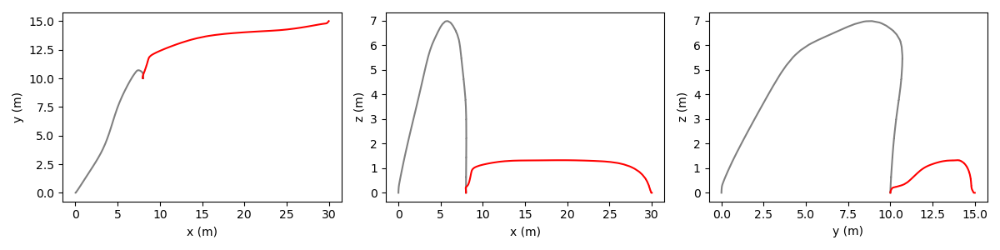
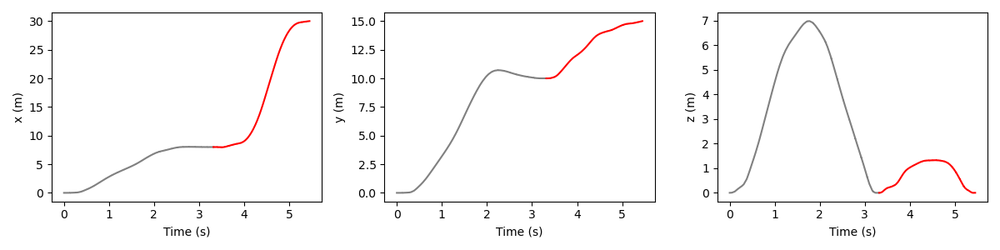
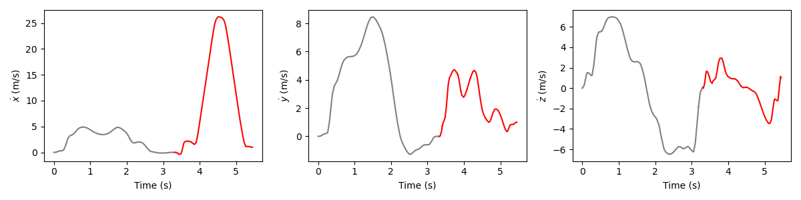
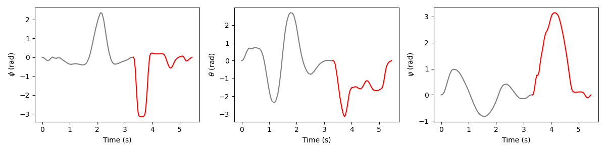
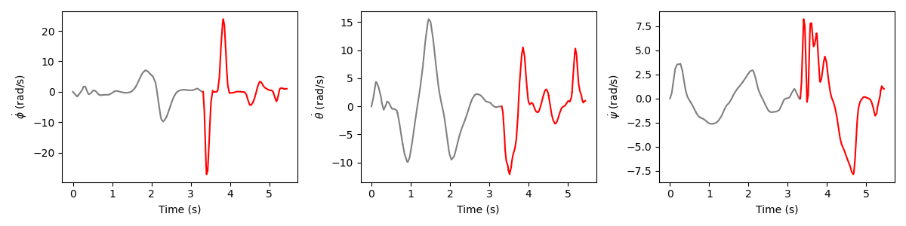
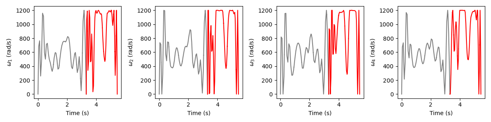

# OpenMDAO-Trajecotry-Optimization
This is a repository to store the code for trajectory optimization of quad-copter in urban environment using openMDAO, Dymos, and pyOptSparse. Currently, the code is written only for two phases of the trajectory. If you want to run the code for more than two phases, you need to make some changes in the code in the cell where the phases are defined.

The following figures provide visual representations of the trajectory and key variables associated with our study. The trajectory comprises two distinct phases: the gray section represents phase 0, which extends from the starting point to the first waypoint, while the red section represents phase 1, covering the segment from the first waypoint to the endpoint. Waypoints serve as connection points between these trajectory phases.

**This is the Plot of the Trajectory of the Quadcopter**

The plot of the trajectory of the quadcopter in 3D space. The purple semi-sphere is the obstacle. The quadcopter starts from the blue dot and end at the orange dot for the phase 0 trajectory. Then the quadcopter starts from the orange dot and ends at the green dot for the phase 1 trajectory. The quadcopter avoids the obstacle and reaches the goal point. 

**This is the Plot of the Trajectory of the Quadcopter in 2D**

The plot of the trajectory of the quadcopter in 2D space. It is the 2D projection of the 3D plot.

**This is the Plot of the Position vs. Time of the Quadcopter**

**This is the Plot of the Velocity vs. Time of the Quadcopter**

**This is the Plot of the Orientation vs. Time of the Quadcopter**

**This is the Plot of the Angular Velocity vs. Time of the Quadcopter**

**This is the Plot of the Control Inputs vs. Time of the Quadcopter**

It can be observed that the control inputs are not very stable. This instability is primarily due to the absence of bounds on the angular acceleration of the four rotors.

** If your are interested in more details of this project, please refer to the following report.**
[Report for the Project](AE588_Final_Project.pdf)

** Contributors:**
Yingqi (James) Shen: Code Development, Dynamic Model Analysis,Problem Formulation, Results Analysis, Results Discussion
Emma Yan: Dynamic Model Analysis & Derivation, Problem Classification